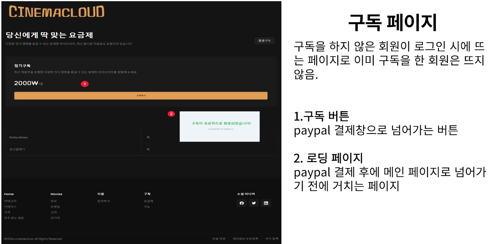

 # Cinemacloud

**Cinemacloud Web OTT Service v1.0**


[시네마클라우드](https://github.com/juseungpark97/FinalProject)

**개발 기간**: 2024.08 ~ 2024.09

## 버전 정보

- **JDK**: Amazon Corretto 17  
  [다운로드 링크](https://docs.aws.amazon.com/ko_kr/corretto/latest/corretto-17-ug/downloads-list.html)
  
- **Spring Boot**: 3.3.2  

- **Spring Tool Suite (STS)**: 4.24.0.RELEASE  
  [다운로드 링크](https://spring.io/tools)

- **SQL Developer**: 23.1.1.345  
  [다운로드 링크](https://www.oracle.com/database/sqldeveloper/technologies/download/)

- **Database**: Oracle Database 21c Express Edition Release 21.0.0.0.0 - Production Version 21.3.0.0.0  
  [다운로드 링크](https://www.oracle.com/database/technologies/xe-downloads.html)

- **Lombok**: 1.18.32  
  [다운로드 링크](https://mvnrepository.com/artifact/org.projectlombok/lombok/1.18.32)

- **Node.js**: v20.15.1  
  [다운로드 링크](https://nodejs.org/en)

- **React**:  
  - 프로젝트 생성: `npx create-react-app my-app` (my-app 이름은 자유롭게 설정 가능)
  - HTTP 클라이언트 설치: `npm install axios`
  - 스타일 라이브러리 설치: `npm install styled-components`
  - 페이지 라우팅 라이브러리 설치: `npm install react-router-dom`
  - 빌드: `npm run build` (배포 시 사용)
  - `node_modules`는 공유 시 제외하여 용량 문제 방지
  - 부트스트랩 패키지 설치: `npm install --save bootstrap`
  - 리액트스트랩 패키지 설치: `npm install --save reactstrap`

## 웹개발팀 인원(총 6명)

- 이은호, 이주빈, 오민혁, 박주승승, 유승혁, 송용하

## 프로젝트 소개

**Cinemacloud**는 다양한 OTT 서비스를 제공하는 웹 애플리케이션으로, 사용자 맞춤형 콘텐츠 추천, 구독 관리, 멀티 프로필 설정 등 다양한 기능을 지원합니다.

### 주요 기능

- **회원가입 및 로그인**
  - JWT 기반 인증 시스템
  - 카카오 API를 이용한 소셜 로그인
- **아이디 및 비밀번호 찾기**
  - SMS 인증을 통한 아이디/비밀번호 찾기
- **영상 업로드**
  - 사용자가 직접 영상 콘텐츠를 업로드
- **구독 기능**
  - 페이팔 연동을 통한 구독 관리
- **멀티 프로필**
  - 하나의 계정에 여러 프로필 설정 가능
- **영상 슬라이더**
  - 메인 화면에서 인기 콘텐츠를 슬라이드 형식으로 제공
- **개인 맞춤 추천 알고리즘**
  - 사용자 선호도를 분석해 맞춤형 콘텐츠 추천
- **관리자 페이지**
  - 콘텐츠 관리, 사용자 관리, 통계 대시보드

### 사용된 기술 스택

- **프론트엔드**:
  - 
  - 
  - 
  - 
- **백엔드**:
  -  (프레임워크로 사용, 자체 서버)
  - JWT 기반 인증
  - Kakao API, PayPal API, GoogleSMS, AWS API, 
- **데이터베이스**:
  - 
- **개발 환경**:
  - 
  - 
  - 
- **서버**:
  - 
  - 
  - 
  - 

### 사용된 API

- Kakao Login API
- PayPal API

## 프로젝트 설정 및 실행 방법

### 프로젝트 Import

1. `import -> Maven -> Existing Maven Projects -> FINALPROJECT(루트폴더)` 선택.

### 포트번호 변경

1. `package.json` 파일의 `scripts` 부분 변경:
   ```json
   "start": "set PORT=3002 && react-scripts start"

### 포트 중복 문제 해결

- 포트 확인: `netstat -a -o`
- 프로세스 종료: `taskkill /f /pid <PID 번호>`

### 기본 개념

- **JDK (Java Development Kit):** Java 애플리케이션 개발을 위한 도구 모음으로, 컴파일러, 표준 라이브러리, 실행 환경 등을 포함합니다.
- **Spring Boot:** 스프링 프레임워크를 기반으로 한 자바 웹 애플리케이션 개발 프레임워크로, 빠르고 간편한 설정을 제공합니다.
- **Spring Tool Suite (STS):** Spring 애플리케이션 개발을 위한 통합 개발 환경(IDE)입니다.
- **SQL Developer:** Oracle에서 제공하는 데이터베이스 관리 도구로, SQL 쿼리 작성, 데이터베이스 관리, 데이터 모델링 등을 지원합니다.
- **Oracle Database:** 오라클에서 제공하는 관계형 데이터베이스 관리 시스템(RDBMS)입니다.
- **Lombok:** 자바에서 반복적으로 작성해야 하는 코드를 자동으로 생성해주는 라이브러리로, 생산성을 높여줍니다.
- **Node.js:** JavaScript 런타임 환경으로, 서버 사이드 애플리케이션을 개발할 때 사용됩니다.
- **npm (Node Package Manager):** Node.js의 기본 패키지 관리자입니다. Node.js 패키지를 설치하고 관리하는 도구입니다.
- **React:** 사용자 인터페이스를 구축하기 위한 JavaScript 라이브러리로, 컴포넌트 기반의 개발 방식을 제공합니다.
- **Axios:** HTTP 클라이언트 라이브러리로, 브라우저와 Node.js에서 모두 사용할 수 있습니다.
- **styled-components:** CSS-in-JS 라이브러리로, JavaScript 파일 내에서 CSS를 작성할 수 있게 해줍니다.
- **react-router-dom:** React 애플리케이션에서 여러 페이지를 구현하기 위한 라이브러리입니다.

### 담당 기능
 - **오프닝 페이지 및 로그인패이지 사용자 인증 및 로그인 처리 로직:**

### 주요 기능
- **일반 로그인**: 이메일과 비밀번호를 통해 사용자를 인증하고, JWT 토큰을 생성하여 반환합니다.
- **카카오 로그인**: OAuth2를 통해 카카오 사용자 인증을 처리하고, 카카오에서 발급한 액세스 토큰을 사용합니다.
### 코드 예시
```java
// 로그인 처리: 이메일과 비밀번호를 통해 사용자를 인증하고, JWT 토큰을 생성하여 반환
public String loginUser(String email, String password) throws BadCredentialsException {
	Optional<USERS> userOpt = userRepository.findByEmail(email);
	if (userOpt.isPresent()) {
		USERS user = userOpt.get();
		// 사용자가 비활성화된 상태인지 확인
		if ("D".equals(user.getStatus())) {
			throw new BadCredentialsException("User account is deactivated.");
		}
		// 비밀번호가 일치하면 JWT 토큰 생성 및 반환
		if (passwordEncoder.matches(password, user.getPassword())) {
			return generateToken(user);
		}
	}
	// 이메일이나 비밀번호가 잘못된 경우 예외 발생
	throw new BadCredentialsException("Invalid email or password");
}

// JWT 토큰 생성 메서드
private String generateToken(USERS user) {
	long now = System.currentTimeMillis();

	return Jwts.builder()
			.setSubject(user.getEmail())  // 토큰의 주제(사용자 이메일) 설정
			.setIssuedAt(new java.util.Date(now))  // 토큰 발급 시간 설정
			.setExpiration(new java.util.Date(now + tokenValidity))  // 토큰 만료 시간 설정
			.signWith(key)  // 서명 키로 토큰 서명
			.compact();  // 토큰 생성 및 문자열로 반환
}

// 홈 페이지 요청 처리: 카카오 OAuth2로 인증된 사용자 정보를 처리
@GetMapping("/home")
public String home(Model model, @AuthenticationPrincipal CustomOAuth2User customOAuth2User) {
   if (customOAuth2User == null) {
       System.out.println("User is not authenticated");
       return "redirect:/login"; // 인증되지 않은 경우 로그인 페이지로 리디렉션
   }
   // 카카오에서 발급한 액세스 토큰 가져오기
   String accessToken = customOAuth2User.getToken();
   model.addAttribute("accessToken", accessToken);
   // 사용자 이름 가져오기 (없으면 'Anonymous User'로 설정)
   String name = (String) customOAuth2User.getAttribute("name");
   model.addAttribute("name", name != null ? name : "Anonymous User");
   // React 애플리케이션의 프로필 페이지로 리디렉션하며 액세스 토큰 전달
   return "redirect:http://localhost:3000/profiles?token=" + accessToken;
}

```
 - ****


### 주요 기능
- **이메일 중복 확인 및 인증 코드 발송**: 이메일 중복 여부를 확인하고, 중복되지 않은 경우 인증 코드를 발송합니다.
- **인증 코드 검증:** 사용자가 입력한 6자리 코드를 서버에서 확인하고, 올바른 경우 완료 메세지를 표시합니다.

### 코드 예시

```typescript
// 이메일 중복 확인 및 인증 코드 발송
const emailCheckResponse = await axios.post('http://localhost:8088/api/users/check-email', {
  email: formData.ID,  // 사용자가 입력한 이메일
});

if (emailCheckResponse.data.exists) {
  alert('이미 사용 중인 이메일입니다.');
  setLoading(false);  // 로딩 상태 해제
  return;  // 이메일이 이미 사용 중이면 중단
}

await axios.post('http://localhost:8088/api/email/send-code', {
  email: formData.ID,  // 사용 가능한 이메일에 인증 코드 발송
});
setIsCodeSent(true);  // 인증 코드 발송 상태 업데이트
alert('이메일 인증 코드가 발송되었습니다.');

...

// 인증 코드 검증
const handleVerifyCode = async (e: React.ChangeEvent<HTMLInputElement>) => {
  const code = e.target.value;

  // 입력된 코드가 6자리인지 확인
  if (code.length !== 6) {
    return;  // 6자리가 아니면 검증하지 않음
  }

  try {
    const response = await axios.post('http://localhost:8088/api/email/verify-code', {
      email: formData.ID,  // 이메일과 함께 코드 전송
      code: code,  // 사용자가 입력한 인증 코드
    });

    if (response.data.verified) {
      setIsEmailVerified(true);  // 이메일 인증 완료 상태 설정
      setIsVerificationComplete(true);  // 전체 인증 완료 상태 설정
      alert('이메일 인증이 완료되었습니다.');
    } else {
      alert('인증 코드가 유효하지 않습니다.');
    }
  } catch (error) {
    alert('이메일 인증에 실패하였습니다.');
  }
};

```

```java
@Autowired
private JavaMailSender emailSender;  // 이메일 전송을 위한 JavaMailSender 객체

private Map<String, String> verificationCodes = new HashMap<>();  // 이메일과 인증 코드를 저장하는 맵

@PostMapping("/send-code")
public void sendVerificationCode(@RequestBody Map<String, String> request) {
    String email = request.get("email");  // 요청으로부터 이메일을 추출
    String code = generateVerificationCode();  // 인증 코드 생성
    verificationCodes.put(email, code);  // 이메일과 생성된 인증 코드를 맵에 저장

    // 인증 코드를 포함한 이메일 메시지 생성 및 전송
    SimpleMailMessage message = new SimpleMailMessage();
    message.setTo(email);
    message.setSubject("이메일 인증 코드");
    message.setText("인증 코드: " + code);
    emailSender.send(message);  // 이메일 발송
}

@PostMapping("/verify-code")
public Map<String, Boolean> verifyCode(@RequestBody Map<String, String> request) {
    String email = request.get("email");  // 요청으로부터 이메일을 추출
    String code = request.get("code");  // 요청으로부터 인증 코드를 추출

    // 인증 코드 검증 결과를 맵에 저장하여 반환
    Map<String, Boolean> response = new HashMap<>();
    response.put("verified", code.equals(verificationCodes.get(email)));  // 인증 코드 일치 여부 확인
    return response;  // 결과 반환
}

private String generateVerificationCode() {
    Random random = new Random();
    int code = 100000 + random.nextInt(900000);  // 6자리 랜덤 인증 코드 생성
    return String.valueOf(code);  // 생성된 코드를 문자열로 반환
}

```
- ****

### 주요 기능
- **SMS 인증**: SmsService 클래스를 사용하여 휴대폰으로 인증 코드를 생성하고 전송합니다. 사용자는 받은 코드를 입력하여 인증 절차를 완료할 수 있습니다.
- **비밀번호 변경**: 사용자가 인증된 후, JWT 토큰에서 추출한 이메일을 기반으로 비밀번호를 변경합니다. 비밀번호 변경이 성공하면 성공 메시지를, 실패하면 오류 메시지를 반환합니다.
### 코드 예시

```java
    package com.kh.last.service;

import org.springframework.beans.factory.annotation.Value;
import org.springframework.stereotype.Service;
import net.nurigo.java_sdk.api.Message;
import net.nurigo.java_sdk.exceptions.CoolsmsException;

import java.util.HashMap;
import java.util.Map;
import java.util.Random;
import java.util.concurrent.ConcurrentHashMap;
import org.slf4j.Logger;
import org.slf4j.LoggerFactory;

@Service
public class SmsService {

    private static final Logger logger = LoggerFactory.getLogger(SmsService.class);

    @Value("${coolsms.api_key}")
    private String apiKey;  // CoolSMS API 키

    @Value("${coolsms.api_secret}")
    private String apiSecret;  // CoolSMS API 비밀 키

    @Value("${coolsms.from}")
    private String from;  // 발신자 번호 (CoolSMS에 등록된 번호)

    // 전화번호와 해당 인증 코드를 저장하는 ConcurrentHashMap (동시성 문제 해결)
    private final Map<String, String> verificationCodes = new ConcurrentHashMap<>();

    // SMS 인증 코드를 생성하고, 지정된 전화번호로 전송
    public void sendVerificationCode(String phoneNumber) throws CoolsmsException {
        String generatedCode = generateVerificationCode();  // 인증 코드 생성
        Message coolsms = new Message(apiKey, apiSecret);  // CoolSMS API 초기화

        // SMS 전송에 필요한 파라미터 설정
        HashMap<String, String> params = new HashMap<>();
        params.put("to", phoneNumber);  // 수신자 전화번호 (국제 형식)
        params.put("from", from);  // 발신자 전화번호
        params.put("type", "sms");
        params.put("text", "인증번호는 [" + generatedCode + "] 입니다.");  // 인증 코드 내용

        try {
            // SMS 전송
            Map<String, String> response = coolsms.send(params);

            // 전송 결과를 로그로 기록
            logger.info("SMS send response: {}", response);
        } catch (CoolsmsException e) {
            // 예외 발생 시 에러 로그 기록 및 예외 재발생
            logger.error("Error sending SMS: {}", e.getMessage());
            throw e;
        }

        // 인증 코드를 맵에 저장
        verificationCodes.put(phoneNumber, generatedCode);
        logger.info("Sent verification code [{}] to phone number [{}]", generatedCode, phoneNumber);
    }

    // 입력된 인증 코드가 저장된 코드와 일치하는지 확인
    public boolean verifyCode(String phoneNumber, String code) {
        String storedCode = verificationCodes.get(phoneNumber);
        if (storedCode != null && storedCode.equals(code)) {
            verificationCodes.remove(phoneNumber);  // 인증 성공 시 코드 삭제
            logger.info("Verification successful for phone number [{}]", phoneNumber);
            return true;
        }
        logger.warn("Verification failed for phone number [{}]. Expected [{}], but got [{}]", phoneNumber, storedCode, code);
        return false;
    }

    // 4자리의 랜덤 인증 코드 생성
    private String generateVerificationCode() {
        Random random = new Random();
        int code = 1000 + random.nextInt(9000);  // 1000에서 9999 사이의 숫자 생성
        return Integer.toString(code);
    }
}

// 비밀번호 변경을 위한 컨트롤러 메소드
@PutMapping("/change-password")
public ResponseEntity<?> changePassword(@RequestHeader("Authorization") String token,
                                        @RequestBody PasswordChangeRequest request) {
    // 토큰에서 이메일 추출 (이메일 추출 로직은 userService 내에 구현)
    String email = userService.getEmailFromToken(token);
    
    if (email == null) {
        return ResponseEntity.status(HttpStatus.UNAUTHORIZED).body("Invalid token");  // 토큰이 유효하지 않은 경우 처리
    }

    // 요청에 이메일 설정
    request.setEmail(email);
    
    // 비밀번호 변경 로직 수행 (성공 시 true 반환)
    boolean success = userService.myPagePwdChange(request);

    if (success) {
        return ResponseEntity.ok().body("Password changed successfully");  // 비밀번호 변경 성공 시
    } else {
        return ResponseEntity.status(HttpStatus.BAD_REQUEST)
                .body("Current password is incorrect or user not found");  // 비밀번호 변경 실패 시
    }
}

```

- **영화 자세히보기**

### 주요 기능
- **영화 비디오플레이어**: 영화 비디오 플레이어를 Material-UI를 사용해 직접 커스텀 했습니다.
- **영화 이어보기**: 기존에 시청했던 영화로 다시 들어가면 영상을 나갔던 시점부터 이어보기 됩니다.
### 코드 예시
```typescript
//비디오 플레이어 커스텀
// MUI 아이콘 가져오기
import PlayArrowIcon from '@mui/icons-material/PlayArrow';
import PauseIcon from '@mui/icons-material/Pause';
import VolumeUpIcon from '@mui/icons-material/VolumeUp';
import VolumeOffIcon from '@mui/icons-material/VolumeOff';
import FullscreenIcon from '@mui/icons-material/Fullscreen'; // 전체 화면 아이콘
import Replay10Icon from '@mui/icons-material/Replay10'; // 10초 뒤로 아이콘
import Forward10Icon from '@mui/icons-material/Forward10'; // 10초 앞으로 아이콘
import ArrowBackIcon from '@mui/icons-material/ArrowBack'; // 뒤로 가기 아이콘

return (
  <Box>
    {/* 뒤로 가기 버튼 */}
    <IconButton onClick={handleBack}>
      <ArrowBackIcon style={{ color: 'white' }} /> {/* 뒤로 가기 아이콘 사용 */}
    </IconButton>

    {/* 재생/일시정지 버튼 */}
    <IconButton onClick={handlePlayPause}>
      {playing ? <PauseIcon /> : <PlayArrowIcon />} {/* 재생/일시정지 아이콘 사용 */}
    </IconButton>

    {/* 10초 뒤로 이동 버튼 */}
    <IconButton onClick={() => videoRef.current.currentTime -= 10}>
      <Replay10Icon /> {/* 10초 뒤로 이동 아이콘 사용 */}
    </IconButton>

    {/* 10초 앞으로 이동 버튼 */}
    <IconButton onClick={handleForward10}>
      <Forward10Icon /> {/* 10초 앞으로 이동 아이콘 사용 */}
    </IconButton>

    {/* 볼륨 조절 버튼 */}
    <IconButton onClick={handleVolumeClick}>
      {muted ? <VolumeOffIcon /> : <VolumeUpIcon />} {/* 음소거/음소거 해제 아이콘 사용 */}
    </IconButton>

    {/* 전체 화면 버튼 */}
    <IconButton onClick={handleFullscreen}>
      <FullscreenIcon /> {/* 전체 화면 아이콘 사용 */}
    </IconButton>
  </Box>
);
```
```java
    // 영화 이어보기
    //시청기록 객체를 가져와서 시청기록이 있다면 반환, 그렇지 않다면 0을 반환해서 0초부터 영상을 시작하게 했습니다.
    @GetMapping("/watchlog")
    public ResponseEntity<Float> getWatchLog(
            @RequestParam Long movieId,
            @RequestParam Long profileNo) {
        Movie movie = movieRepository.findById(movieId)
                .orElseThrow(() -> new ResourceNotFoundException("Movie not found with id " + movieId));
        Profile profile = profileRepository.findById(profileNo)
                .orElseThrow(() -> new ResourceNotFoundException("Profile not found with id " + profileNo));

        Optional<WatchLog> watchLog = watchLogRepository.findByProfileAndMovie(profile, movie);
        if (watchLog.isPresent()) {
            return ResponseEntity.ok(watchLog.get().getProgressTime()); // 시청 시간 반환
        } else {
            return ResponseEntity.ok(0f); // 시청 기록이 없으면 0 반환
        }
    }
```

- **구독 성공시 처리**

### 주요 기능
- **구독 성공시 구독처리**: 구독에 성공했을시 구독 성공 이메일 전송과 구독처리를 합니다.
### 코드 예시
```typescript
// 결제 후 구독처리: 페이팔 결제후 구독처리
@PostMapping("/pay")
public ResponseEntity<Map<String, String>> pay(@RequestParam("sum") double sum) {
	try {
		Map<String, String> paymentResponse = paymentService.createPayment(sum, "USD", "paypal", "sale",
				"Payment description", "http://localhost:8088/paypal/cancel",
				"http://localhost:8088/paypal/success");
		return ResponseEntity.ok(paymentResponse);
	} catch (PayPalRESTException e) {
		e.printStackTrace();
		return ResponseEntity.status(500).body(Map.of("error", "Payment failed"));
	}
}
const subscribeUser = async () => {
   try {
       const response = await axios.post('http://localhost:8088/api/users/subscribe', null, {
           headers: {
               'Authorization': `Bearer ${token}`,
           },
           params: {
               months: 1,
           }
       });
       console.log('구독이 성공적으로 처리되었습니다:', response.data);
       // user 객체에서 이메일 추출
       const userEmail = response.data.user.email;
       console.log('사용자 이메일:', userEmail);
       // 구독 성공 이메일 발송
       if (userEmail) {
           try {
               await axios.post('http://localhost:8088/api/email/send-subscribe-success', { email: userEmail });
               console.log('구독 성공 이메일이 발송되었습니다.');
           } catch (error) {
               console.error('구독 성공 이메일 발송 중 오류 발생:', error);
           }
       }
       setTimeout(() => {
           navigate('/profiles');
       }, 5000);
   } catch (error) {
       console.error('구독 처리 중 오류 발생:', error);
   }
};
```


