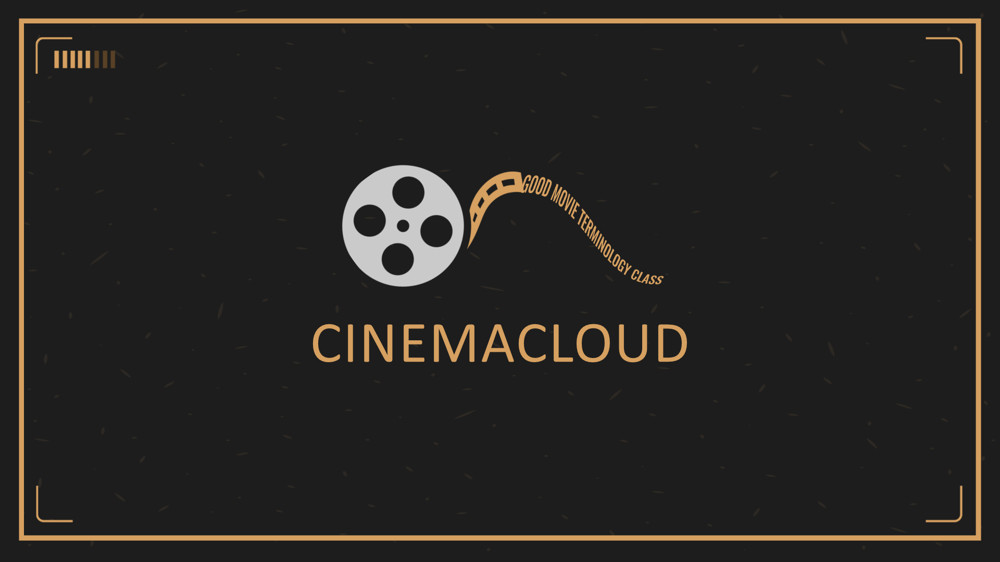
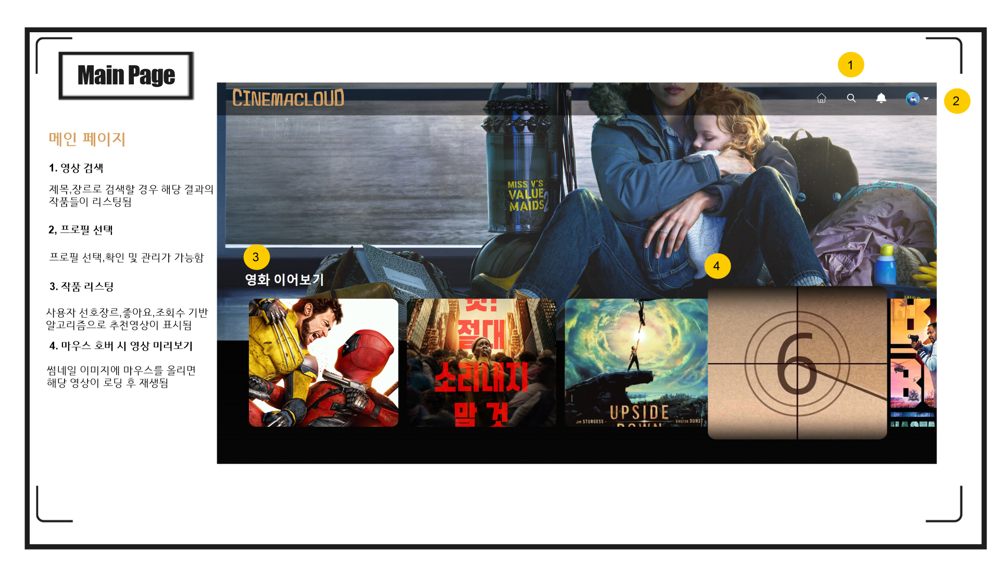
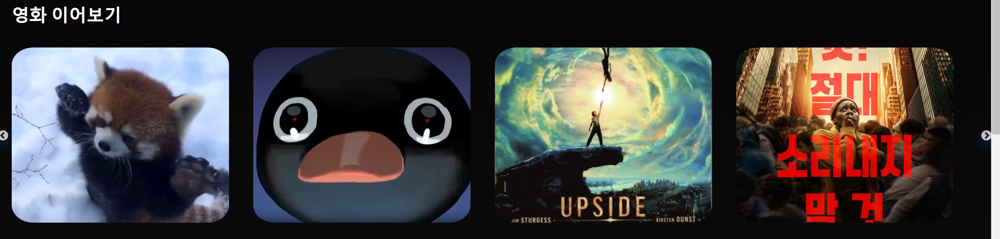
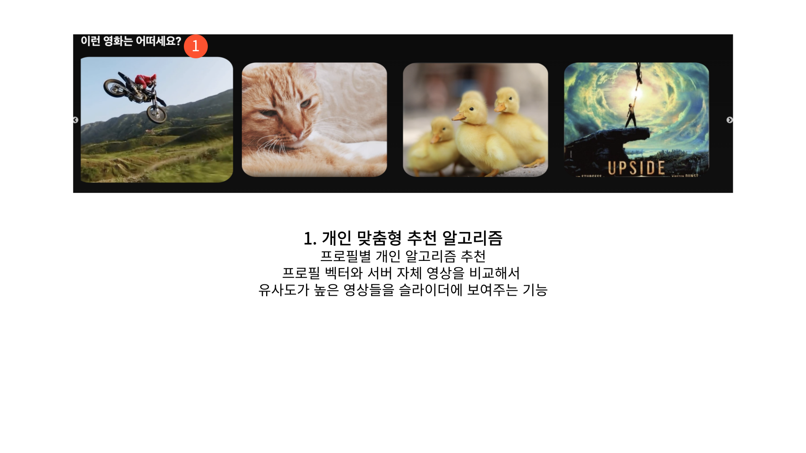
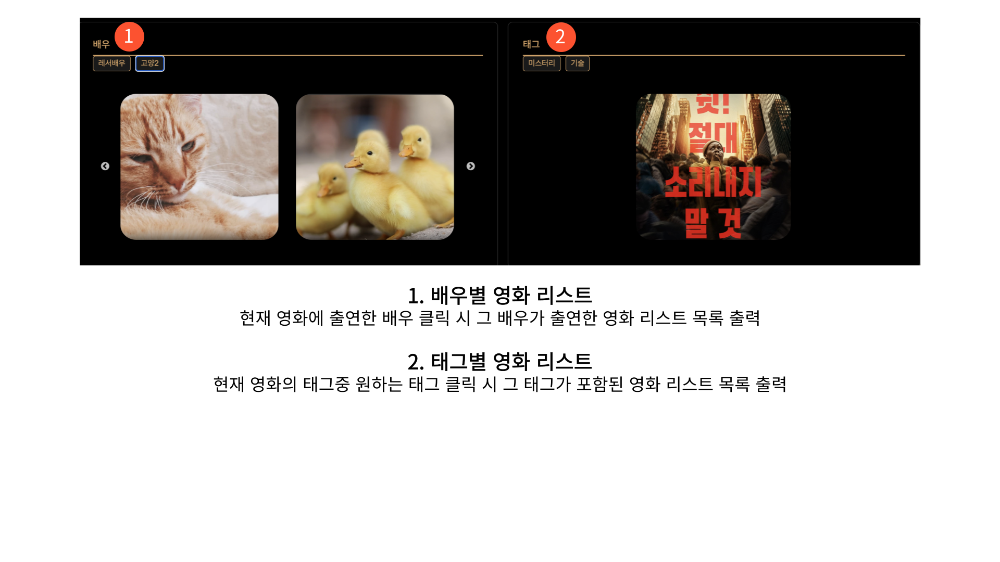

# Cinemacloud

**Cinemacloud Web OTT Service v1.0**


[시네마클라우드](https://github.com/juseungpark97/FinalProject)

**개발 기간**: 2024.08 ~ 2024.09

## 버전 정보

- **JDK**: Amazon Corretto 17  
  [다운로드 링크](https://docs.aws.amazon.com/ko_kr/corretto/latest/corretto-17-ug/downloads-list.html)
  
- **Spring Boot**: 3.3.2  

- **Spring Tool Suite (STS)**: 4.24.0.RELEASE  
  [다운로드 링크](https://spring.io/tools)

- **SQL Developer**: 23.1.1.345  
  [다운로드 링크](https://www.oracle.com/database/sqldeveloper/technologies/download/)

- **Database**: Oracle Database 21c Express Edition Release 21.0.0.0.0 - Production Version 21.3.0.0.0  
  [다운로드 링크](https://www.oracle.com/database/technologies/xe-downloads.html)

- **Lombok**: 1.18.32  
  [다운로드 링크](https://mvnrepository.com/artifact/org.projectlombok/lombok/1.18.32)

- **Node.js**: v20.15.1  
  [다운로드 링크](https://nodejs.org/en)

- **React**:  
  - 프로젝트 생성: `npx create-react-app my-app` (my-app 이름은 자유롭게 설정 가능)
  - HTTP 클라이언트 설치: `npm install axios`
  - 스타일 라이브러리 설치: `npm install styled-components`
  - 페이지 라우팅 라이브러리 설치: `npm install react-router-dom`
  - 빌드: `npm run build` (배포 시 사용)
  - `node_modules`는 공유 시 제외하여 용량 문제 방지
  - 부트스트랩 패키지 설치: `npm install --save bootstrap`
  - 리액트스트랩 패키지 설치: `npm install --save reactstrap`

## 웹개발팀 인원(총 6명)

- 박주승, 이주빈, 오민혁, 이은호, 유승혁, 송용하

## 프로젝트 소개

**Cinemacloud**는 다양한 OTT 서비스를 제공하는 웹 애플리케이션으로, 사용자 맞춤형 콘텐츠 추천, 구독 관리, 멀티 프로필 설정 등 다양한 기능을 지원합니다.

### 주요 기능

- **회원가입 및 로그인**
  - JWT 기반 인증 시스템
  - 카카오 API를 이용한 소셜 로그인
- **아이디 및 비밀번호 찾기**
  - SMS 인증을 통한 아이디/비밀번호 찾기
- **영상 업로드**
  - 사용자가 직접 영상 콘텐츠를 업로드
- **구독 기능**
  - 페이팔 연동을 통한 구독 관리
- **멀티 프로필**
  - 하나의 계정에 여러 프로필 설정 가능
- **영상 슬라이더**
  - 메인 화면에서 인기 콘텐츠를 슬라이드 형식으로 제공
- **개인 맞춤 추천 알고리즘**
  - 사용자 선호도를 분석해 맞춤형 콘텐츠 추천
- **관리자 페이지**
  - 콘텐츠 관리, 사용자 관리, 통계 대시보드

### 사용된 기술 스택

- **프론트엔드**:
  - 
  - 
  - 
  - 
- **백엔드**:
  -  (프레임워크로 사용, 자체 서버)
  - JWT 기반 인증
  - Kakao API, PayPal API, GoogleSMS, AWS API, 
- **데이터베이스**:
  - 
- **개발 환경**:
  - 
  - 
  - 
- **서버**:
  - 
  - 
  - 
  - 

### 사용된 API

- Kakao Login API
- PayPal API

## 프로젝트 설정 및 실행 방법

### 프로젝트 Import

1. `import -> Maven -> Existing Maven Projects -> FINALPROJECT(루트폴더)` 선택.

### 포트번호 변경

1. `package.json` 파일의 `scripts` 부분 변경:
   ```json
   "start": "set PORT=3002 && react-scripts start"

### 포트 중복 문제 해결

- 포트 확인: `netstat -a -o`
- 프로세스 종료: `taskkill /f /pid <PID 번호>`

### 기본 개념

- **JDK (Java Development Kit):** Java 애플리케이션 개발을 위한 도구 모음으로, 컴파일러, 표준 라이브러리, 실행 환경 등을 포함합니다.
- **Spring Boot:** 스프링 프레임워크를 기반으로 한 자바 웹 애플리케이션 개발 프레임워크로, 빠르고 간편한 설정을 제공합니다.
- **Spring Tool Suite (STS):** Spring 애플리케이션 개발을 위한 통합 개발 환경(IDE)입니다.
- **SQL Developer:** Oracle에서 제공하는 데이터베이스 관리 도구로, SQL 쿼리 작성, 데이터베이스 관리, 데이터 모델링 등을 지원합니다.
- **Oracle Database:** 오라클에서 제공하는 관계형 데이터베이스 관리 시스템(RDBMS)입니다.
- **Lombok:** 자바에서 반복적으로 작성해야 하는 코드를 자동으로 생성해주는 라이브러리로, 생산성을 높여줍니다.
- **Node.js:** JavaScript 런타임 환경으로, 서버 사이드 애플리케이션을 개발할 때 사용됩니다.
- **npm (Node Package Manager):** Node.js의 기본 패키지 관리자입니다. Node.js 패키지를 설치하고 관리하는 도구입니다.
- **React:** 사용자 인터페이스를 구축하기 위한 JavaScript 라이브러리로, 컴포넌트 기반의 개발 방식을 제공합니다.
- **Axios:** HTTP 클라이언트 라이브러리로, 브라우저와 Node.js에서 모두 사용할 수 있습니다.
- **styled-components:** CSS-in-JS 라이브러리로, JavaScript 파일 내에서 CSS를 작성할 수 있게 해줍니다.
- **react-router-dom:** React 애플리케이션에서 여러 페이지를 구현하기 위한 라이브러리입니다.

### 담당 기능
 - **aws S3 업로드 및 다운로드**

### 주요 기능
- **비디오 및 썸네일 업로드**: 사용자가 업로드한 비디오 파일과 썸네일 이미지를 Amazon S3에 업로드합니다.
- **S3 URL 생성 및 Movie 객체 생성**: 업로드된 파일의 URL을 가져와 Movie 객체를 생성하고 데이터베이스에 저장합니다.
### 코드 예시
```java
@Service
@RequiredArgsConstructor
public class MovieService {
    private final AmazonS3 amazonS3;
    private final MovieRepository movieRepository;

    @Value("${aws.s3.bucketName}")
    private String awsS3BucketName;

    public Movie uploadMovie(MultipartFile file, MultipartFile thumbnail, String title, String director,
                             String cast, int releaseYear, String synopsis, float rating, String tags) throws IOException {
        // S3 키 설정
        String videoKey = "movies/" + file.getOriginalFilename();
        String thumbnailKey = "thumbnail/" + thumbnail.getOriginalFilename();

        // S3에 비디오 및 썸네일 파일 업로드
        amazonS3.putObject(new PutObjectRequest(awsS3BucketName, videoKey, file.getInputStream(), new ObjectMetadata()));
        amazonS3.putObject(new PutObjectRequest(awsS3BucketName, thumbnailKey, thumbnail.getInputStream(), new ObjectMetadata()));

        // 비디오 파일의 메타데이터 설정 
        ObjectMetadata videoMetadata = new ObjectMetadata();
        videoMetadata.setContentType("video/mp4"); // 비디오 파일의 MIME 타입 설정

        // 썸네일 파일의 메타데이터 설정
        ObjectMetadata thumbnailMetadata = new ObjectMetadata();
        thumbnailMetadata.setContentType("image/jpeg"); // 썸네일 이미지의 MIME 타입 설정

        // URL 생성
        String videoUrl = amazonS3.getUrl(awsS3BucketName, videoKey).toString();
        String thumbnailUrl = amazonS3.getUrl(awsS3BucketName, thumbnailKey).toString();

        // Movie 객체 생성 및 데이터 설정
        Movie movie = new Movie();
        movie.setTitle(title);
        movie.setUrl(videoUrl);
        movie.setThumbnailUrl(thumbnailUrl);
        movie.setTagList(Arrays.asList(tags.split(",")));
        movie.setCastList(Arrays.asList(cast.split(",")));

        return movieRepository.save(movie);
    }

    // 필터별 검색 기능
    public List<Movie> findMoviesByGenre(String genre) {
        return movieRepository.findByGenre(genre);
    }
}
```
 - **슬라이더 컴포넌트, 썸네일 컴포넌트**


### 주요 기능
- **슬라이더 컴포넌트**: 영화 목록을 슬라이드 형식으로 보여주며, 반응형으로 동작합니다.
- **썸네일 컴포넌트**: 비디오의 썸네일을 표시하고, 호버 시 비디오가 재생됩니다. 클릭 시 해당 비디오의 상세 페이지로 이동합니다.

### 코드 예시

```typescript
// 슬라이더 섹션 컴포넌트
const SliderSection = ({ title, movies }) => {
    // 슬라이더 설정을 반환하는 함수
    const getSliderSettings = (movieCount) => ({
        dots: false, // 슬라이더 하단 점 표시 비활성화
        infinite: movieCount > 4, // 영화 개수가 4개 이상일 때만 무한 루프 활성화
        speed: 600, // 슬라이더 이동 속도
        slidesToShow: 4, // 한 번에 표시할 슬라이드 수
        responsive: [
            {
                breakpoint: 1024, // 화면 크기가 1024px 이하일 때 설정 변경
                settings: {
                    slidesToShow: 2,
                    infinite: movieCount > 2
                }
            },
            {
                breakpoint: 600, // 화면 크기가 600px 이하일 때 설정 변경
                settings: {
                    slidesToShow: 1,
                    infinite: movieCount > 1
                }
            }
        ]
    });

    return (
        <div className={styles.section}>
            <h2 className={styles.sectionTitle}>{title}</h2>
            {/* 슬라이더 컴포넌트 */}
            <Slider {...getSliderSettings(movies.length)} className={styles.tileRows}>
                {movies.map((movie, index) => (
                    <div className={styles.tile} key={index}>
                        {/* 각 영화에 대한 썸네일 컴포넌트 */}
                        <VideoThumbnail video={movie} />
                    </div>
                ))}
            </Slider>
        </div>
    );
};
```
```typescript
const VideoThumbnail = memo(({ video }) => {
    const videoRef = useRef(null); // 비디오 엘리먼트를 참조하는 ref
    const [isHovered, setIsHovered] = useState(false); // 호버 상태를 관리
    const [isVideoLoaded, setIsVideoLoaded] = useState(false); // 비디오가 로드되었는지 여부를 관리
    const navigate = useNavigate();

    // 비디오가 뷰포트에 들어왔을 때 자동으로 로드되도록 설정
    useEffect(() => {
        const observer = new IntersectionObserver(
            ([entry]) => {
                if (entry.isIntersecting && videoRef.current) {
                    videoRef.current.preload = 'auto';
                    videoRef.current.load();
                    observer.unobserve(videoRef.current); // 로드가 시작되면 관찰 중지
                }
            },
            { threshold: 0.1 }
        );

        if (videoRef.current) {
            observer.observe(videoRef.current);
        }

        return () => {
            if (videoRef.current) {
                observer.unobserve(videoRef.current);
            }
        };
    }, [video.url]);

    // 마우스 호버 시 비디오 재생
    const handleMouseEnter = () => {
        setIsHovered(true);
        if (videoRef.current && isVideoLoaded) {
            videoRef.current.play().catch(error => console.error('Video play interrupted:', error));
        }
    };

    // 마우스 호버 해제 시 비디오 일시 정지 및 초기화
    const handleMouseLeave = () => {
        setIsHovered(false);
        if (videoRef.current) {
            videoRef.current.pause();
            videoRef.current.currentTime = 0;
        }
    };

    // 비디오 로드 완료 시 호출되는 핸들러
    const handleLoadedData = () => {
        setIsVideoLoaded(true);
        if (isHovered) {
            videoRef.current?.play().catch(error => console.error('Video play interrupted:', error));
        }
    };

    // 썸네일 클릭 시 상세 페이지로 이동
    const handleClick = () => {
        navigate(`/movie/${video.id}`);
    };

    return (
        <div
            className={styles.thumbnail}
            onMouseEnter={handleMouseEnter}
            onMouseLeave={handleMouseLeave}
            onClick={handleClick}
        >
            {/* 비디오 썸네일 이미지 */}
            
            {/* 비디오 엘리먼트 */}
            <video
                ref={videoRef}
                muted
                className={styles.video}
                style={{ display: isHovered && isVideoLoaded ? 'block' : 'none' }}
                onLoadedData={handleLoadedData}
            >
                <source src={video.url} type="video/mp4" />
                Your browser does not support the video tag.
            </video>
        </div>
    );
});
```

- **사용자 맞춤 알고리즘**

### 주요 기능
- **맞춤 알고리즘**: 사용자가 누른 영화들을 기반으로 맞춤형 영화를 추천합니다.
### 코드 예시

```java
    private static final List<String> ALL_TAGS = Arrays.asList(
        "드라마", "로맨스", "코미디", "스릴러", "미스터리", "호러", "액션", "SF", "판타지",
        "다큐멘터리", "어드벤처", "우화", "다문화", "가족", "음악", "해적", "심리적", "비극적",
        "극복", "서스펜스", "정서적", "사랑", "운명", "실화", "철학적", "형이상학적", "패러디",
        "반전", "서정적", "상상력", "유머", "혼란", "노스탤지어", "실험적", "미니멀리즘", "예술적",
        "하이테크", "가상 현실", "미래적", "고전", "전쟁", "역사적", "대체 역사", "미래", "도시",
        "자연", "실험실", "우주", "도시 전쟁", "기술", "사회적", "심리전", "성장", "관계",
        "극단적", "아동"
    );

    public List<Movie> getRecommendations(Long profileId) {
        Profile profile = profileRepository.findById(profileId)
                .orElseThrow(() -> new IllegalArgumentException("Invalid profile ID"));

        Map<String, Integer> profileTags = parseJsonToMap(profile.getProfileVector());

        List<Movie> recommendations = new ArrayList<>();
        for (Movie movie : movieRepository.findAll()) {
            List<String> movieTags = parseJsonToList(movie.getTags());
            double similarity = calculateCosineSimilarity(profileTags, movieTags);
            if (similarity > 0.1) {  // 임계치 예시
                recommendations.add(movie);
            }
        }
        return recommendations;
    }

    private double calculateCosineSimilarity(Map<String, Integer> profileTags, List<String> movieTags) {
        int[] profileVector = createVectorFromTags(profileTags);
        int[] movieVector = createVectorFromTags(movieTags);

        double dotProduct = 0.0;
        double profileMagnitude = 0.0;
        double movieMagnitude = 0.0;

        // Compute dot product and magnitudes
        for (int i = 0; i < profileVector.length; i++) {
            dotProduct += profileVector[i] * movieVector[i];
            profileMagnitude += Math.pow(profileVector[i], 2);
            movieMagnitude += Math.pow(movieVector[i], 2);
        }

        profileMagnitude = Math.sqrt(profileMagnitude);
        movieMagnitude = Math.sqrt(movieMagnitude);

        // Debugging output
        System.out.println("Dot Product: " + dotProduct);
        System.out.println("Profile Magnitude: " + profileMagnitude);
        System.out.println("Movie Magnitude: " + movieMagnitude);

        if (profileMagnitude == 0 || movieMagnitude == 0) {
            System.out.println("One of the vectors has zero magnitude, returning similarity of 0.0");
            return 0.0;  // Avoid division by zero
        }

        double similarity = dotProduct / (profileMagnitude * movieMagnitude);
        System.out.println("Raw Cosine Similarity: " + similarity);

        // Ensure similarity is within [0, 1]
        double clampedSimilarity = Math.min(Math.max(similarity, 0.0), 1.0);
        System.out.println("Clamped Cosine Similarity: " + clampedSimilarity);
        
        return clampedSimilarity;
    }
```

- **영화 자세히보기**

### 주요 기능
- **영화 비디오플레이어**: 영화 비디오 플레이어를 Material-UI를 사용해 직접 커스텀 했습니다.
- **영화 이어보기**: 기존에 시청했던 영화로 다시 들어가면 영상을 나갔던 시점부터 이어보기 됩니다.
### 코드 예시
```typescript
//비디오 플레이어 커스텀
// MUI 아이콘 가져오기
import PlayArrowIcon from '@mui/icons-material/PlayArrow';
import PauseIcon from '@mui/icons-material/Pause';
import VolumeUpIcon from '@mui/icons-material/VolumeUp';
import VolumeOffIcon from '@mui/icons-material/VolumeOff';
import FullscreenIcon from '@mui/icons-material/Fullscreen'; // 전체 화면 아이콘
import Replay10Icon from '@mui/icons-material/Replay10'; // 10초 뒤로 아이콘
import Forward10Icon from '@mui/icons-material/Forward10'; // 10초 앞으로 아이콘
import ArrowBackIcon from '@mui/icons-material/ArrowBack'; // 뒤로 가기 아이콘

return (
  <Box>
    {/* 뒤로 가기 버튼 */}
    <IconButton onClick={handleBack}>
      <ArrowBackIcon style={{ color: 'white' }} /> {/* 뒤로 가기 아이콘 사용 */}
    </IconButton>

    {/* 재생/일시정지 버튼 */}
    <IconButton onClick={handlePlayPause}>
      {playing ? <PauseIcon /> : <PlayArrowIcon />} {/* 재생/일시정지 아이콘 사용 */}
    </IconButton>

    {/* 10초 뒤로 이동 버튼 */}
    <IconButton onClick={() => videoRef.current.currentTime -= 10}>
      <Replay10Icon /> {/* 10초 뒤로 이동 아이콘 사용 */}
    </IconButton>

    {/* 10초 앞으로 이동 버튼 */}
    <IconButton onClick={handleForward10}>
      <Forward10Icon /> {/* 10초 앞으로 이동 아이콘 사용 */}
    </IconButton>

    {/* 볼륨 조절 버튼 */}
    <IconButton onClick={handleVolumeClick}>
      {muted ? <VolumeOffIcon /> : <VolumeUpIcon />} {/* 음소거/음소거 해제 아이콘 사용 */}
    </IconButton>

    {/* 전체 화면 버튼 */}
    <IconButton onClick={handleFullscreen}>
      <FullscreenIcon /> {/* 전체 화면 아이콘 사용 */}
    </IconButton>
  </Box>
);
```
```java
    // 영화 이어보기
    //시청기록 객체를 가져와서 시청기록이 있다면 반환, 그렇지 않다면 0을 반환해서 0초부터 영상을 시작하게 했습니다.
    @GetMapping("/watchlog")
    public ResponseEntity<Float> getWatchLog(
            @RequestParam Long movieId,
            @RequestParam Long profileNo) {
        Movie movie = movieRepository.findById(movieId)
                .orElseThrow(() -> new ResourceNotFoundException("Movie not found with id " + movieId));
        Profile profile = profileRepository.findById(profileNo)
                .orElseThrow(() -> new ResourceNotFoundException("Profile not found with id " + profileNo));

        Optional<WatchLog> watchLog = watchLogRepository.findByProfileAndMovie(profile, movie);
        if (watchLog.isPresent()) {
            return ResponseEntity.ok(watchLog.get().getProgressTime()); // 시청 시간 반환
        } else {
            return ResponseEntity.ok(0f); // 시청 기록이 없으면 0 반환
        }
    }
```

- **영화 자세히보기(배우별, 태그별 슬라이더)**

### 주요 기능
- **태그 슬라이더**: 현재 시청하는 영화의 태그를 누르면 그 영화의 태그와 동일한 영화들을 슬라이더에 추천합니다.
- **배우 슬라이더**: 현재 시청하는 영화의 배우 누르면 그 영화의 배우가 출연한 영화들을 슬라이더에 추천합니다.
### 코드 예시
```typescript
// 특정 배우가 출연한 영화 요청
const useMoviesByCast = (cast: string) => {
    const [moviesByCast, setMoviesByCast] = useState<Movie[]>([]);
    const [loading, setLoading] = useState(true);
    const [error, setError] = useState<string | null>(null);

    useEffect(() => {
        if (cast) {
            axios.get(`http://localhost:8088/api/movies/cast?cast=${encodeURIComponent(cast)}`)
                .then(response => {
                    setMoviesByCast(response.data);
                    setLoading(false);
                })
                .catch(error => {
                    setError('관련 영화를 가져오는 중 오류가 발생했습니다.');
                    setLoading(false);
                });
        }
    }, [cast]);

    return { moviesByCast, loading, error };
};
```
```java
// 배우가 출연한 영화 반환
    @GetMapping("/cast")
    public List<Movie> getMoviesByCast(@RequestParam("cast") String cast) {
        return movieService.findMoviesByCast(cast);
```


